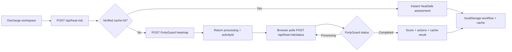

# HeatSafe Discharge

Heat-aware discharge coordination platform that combines real FortyGuard environmental data with patient vulnerability, medication factors, home/support conditions, and the hospital-to-home transition to help discharge teams prioritize safer post-hospital transitions.

**Live demo:** [fortyguard-hackathon.vercel.app](https://fortyguard-hackathon.vercel.app)  
**Repository:** [github.com/AK-RM/fortyguard-hackathon](https://github.com/AK-RM/fortyguard-hackathon)  
**Built for:** FortyGuard Hackathon '26  
**Status:** Hackathon deployment — not clinically validated

---

## The Problem

A patient can be medically stable at discharge and still return to an unsafe environmental setting. During extreme urban heat, patients with cardiovascular disease, heart failure, kidney disease, respiratory disease, diabetes, advanced age, limited mobility, and heat-sensitive medications may be more vulnerable in the first days after leaving the hospital.

Traditional discharge planning considers clinical readiness and social support, but often does not incorporate **environmental heat exposure at the post-discharge destination** or **heat exposure during the hospital-to-home transition**.

## The Product

HeatSafe Discharge is a **heat-aware discharge coordination platform** designed to sit in hospital discharge workflow:

```
Today's discharges
    → Select patient
    → Hospital / origin
    → Hospital → home transition
    → Post-discharge destination
    → FortyGuard destination environmental exposure
      + Transition exposure heuristic
      + Patient vulnerability
      + Medication factors
      + Home/social support
    → Transparent workflow prioritization
    → Assigned discharge interventions
    → Track interventions to resolution
```

The platform provides:

- **Operational discharge dashboard** with synthetic patient IDs (HS-001, HS-002, HS-003)
- **One-click A/B/C demo cases** that populate the full workflow
- **Hospital → journey → home model** with Arizona location presets
- **Real FortyGuard destination environmental data** for the destination-local hourly window containing estimated arrival
- **Transparent transition exposure logic** based on transport mode and configured journey duration
- **Workflow prioritization score (0–100)** with expandable “Why this score?” breakdown
- **Assigned discharge interventions** with owner, status, and local tracking
- **HeatSafe-generated discharge considerations** summarizing what the tool added to the plan

HeatSafe augments clinical judgment. It does **not** replace clinician oversight, automatically change medications, or predict readmission or mortality.

## Demo Workflow

1. Open the **Today's discharges** dashboard.
2. Click **HS-001**, **HS-002**, or **HS-003**, or create a **New discharge assessment**.
3. Use **Load Case A/B/C** to populate the full synthetic workflow in one click.
4. Review **origin**, **journey** (transport + configured duration), and **destination**.
5. Adjust patient, medication, and home/social factors as needed.
6. Click **Run HeatSafe assessment** — verified environmental data returns instantly; uncached Arizona locations submit a real FortyGuard job and enter a transparent processing state.
7. Review the **workflow prioritization score**, **FortyGuard environmental intelligence**, and **Why this score?** breakdown.
8. Work through **assigned discharge interventions** — update status from pending → in progress → completed.
9. Review **HeatSafe-generated discharge considerations** and the safety/provenance panel.

### Hackathon deployment constraints

- **Arizona locations only** — the hackathon API key is state-restricted; coordinates outside Arizona are rejected with a clear validation message.
- **Validated Phoenix demo preset** — one-click load of the tested Central Phoenix scenario (18 Aug 2026, 14:00 local).
- **Synthetic patients only** — HS-001/002/003; no names, MRNs, addresses, or direct identifiers.
- **Local browser persistence** — workflow state, pending activity IDs, and completed environmental cache entries are stored in `localStorage` on the demo device.
- **Asynchronous FortyGuard path** — uncached locations submit one real heatmap job and return immediately; the browser polls `/api/heat-risk/status` without blocking clinicians for minutes.

## Real vs Synthetic Data

| Data | Status |
| --- | --- |
| FortyGuard destination environmental temperature data | **Real** — verified historical seed for standardized cases; live async completion for uncached Arizona queries |
| Transition exposure | **Deterministic workflow heuristic** — derived from destination heat + transport mode + configured duration |
| Patient profiles (HS-001/002/003) | **Synthetic** |
| Conditions, medications, home/social factors | **Synthetic / editable demo inputs** |
| Journey duration | **Coordinator-entered configuration** — not a calculated route |
| Hospital → destination map | **Geographic overview only** — not a FortyGuard heatmap or road route |
| Patient identifiers / PHI | **Not requested** — synthetic IDs only |

## Why FortyGuard?

Discharge planning needs **environmental context at the patient's destination**. FortyGuard provides location-specific environmental heat data designed for urban-heat analysis that can be incorporated into discharge workflows.

HeatSafe uses FortyGuard because:

- The heatmap API accepts a **GeoJSON area of interest** centered on discharge coordinates.
- **`filter_type=1` supplies a Single Hour heatmap** — HeatSafe selects the destination-local hourly window that contains the estimated arrival time (not minute-level measurement).
- Each assessment returns an **activity ID** and normalized temperature statistics for request traceability and API transparency.
- Environmental data integrates into an operational server-side workflow rather than a generic forecast widget.

### FortyGuard time semantics (verified for hackathon deployment)

1. HeatSafe computes **exact estimated local arrival** from coordinator-entered departure time + journey duration.
2. FortyGuard `start_time` is **local time at the AOI**, not UTC.
3. HeatSafe maps estimated arrival to the **containing whole-hour bucket** (e.g. arrival 14:45 → query hour 14:00 for window 14:00–15:00 local).
4. This provides **environmental context for workflow prioritization**, not temperature measured exactly at the arrival minute.

**Case A example:** departure 2026-08-18 14:00 America/Phoenix + 45 min → estimated arrival 14:45 local → FortyGuard request `start_date: 2026-08-18`, `start_time: 14:00`, `filter_type: 1`.

## Environmental Data Architecture

HeatSafe decouples environmental data acquisition from clinician-facing review. When a planned discharge destination and arrival window become available, FortyGuard environmental intelligence can be prepared asynchronously and stored with full provenance.

- **Verified cache hit:** If verified environmental data for the exact canonical query is already available, clinical assessment is immediate.
- **Uncached Arizona query:** HeatSafe submits one real FortyGuard heatmap job, returns `processing` immediately, and the browser polls status every ~5 seconds while the case is open.
- **Resume without duplicate jobs:** Pending `activityId` values persist in browser storage; reopening or refreshing resumes the same FortyGuard activity.
- **Refresh from FortyGuard:** Explicitly bypasses cache for the same query while keeping the current verified result visible until a new live result completes.
- **Stale input safety:** Fingerprint changes invalidate pending activities so old FortyGuard results cannot finalize the wrong patient/input set. Completed environmental data may still enter the cache for its exact query.

Standardized demo cases **A/B/C** intentionally share one **verified historical FortyGuard result** for Central Phoenix (2026-08-18 14:00–15:00 local) so environmental exposure is controlled while patient vulnerability profiles remain distinct. Arbitrary Arizona coordinates are **not** hardcoded and use the live async path.

Cached verified data is never described as live. Numerical HeatSafe weights remain heuristic and are **not clinically calibrated**.

A production hospital deployment would persist activities and environmental results server-side so multiple users and devices share them. This hackathon deployment uses browser persistence for workflow state.

## Architecture



### Key modules

| File | Role |
| --- | --- |
| `src/components/discharge-dashboard.tsx` | Today's discharges operational dashboard |
| `src/components/discharge-workspace.tsx` | Full discharge assessment and intervention workspace |
| `src/lib/demo-cases.ts` | A/B/C synthetic case definitions (HS-001/002/003) |
| `src/lib/arizona-locations.ts` | Arizona presets and coordinate validation |
| `src/lib/transition-exposure.ts` | Deterministic hospital-to-home transition heuristic |
| `src/lib/heat-discharge-risk.ts` | Weighted scoring engine with structured contributions |
| `src/lib/discharge-actions.ts` | Action task creation and status updates |
| `src/lib/discharge-storage.ts` | Browser localStorage persistence layer |
| `src/app/api/heat-risk/route.ts` | Assessment submit: verified cache hit or async FortyGuard job |
| `src/lib/environmental-query.ts` | Canonical FortyGuard environmental query + cache key |
| `src/lib/verified-environmental-seed.ts` | Verified historical Central Phoenix FortyGuard result |
| `src/lib/environmental-cache.ts` | Verified + browser cache lookup/store helpers |
| `src/app/api/heat-risk/status/route.ts` | One-check FortyGuard status + assessment finalization |

## Scoring Methodology

### Evidence-informed factor selection

HeatSafe includes factors recognized as heat-vulnerability considerations in discharge coordination:

- Advanced age
- Cardiovascular disease, heart failure, kidney disease, respiratory disease, diabetes
- Cognitive impairment and limited mobility
- Heat-sensitive medication classes
- Home cooling, isolation, transport, caregiver access, power-dependent equipment
- Destination environmental heat and hospital-to-home transition exposure

These factors inform **what the workflow surfaces** — not validated outcome probabilities.

### Heuristic relative weighting — not clinically calibrated

The exact numerical points are **not fitted clinical coefficients**. They are deterministic relative priorities designed to:

- Make major vulnerability combinations escalate appropriately
- Remain transparent and inspectable via the score explainer
- Be tunable under future clinical governance

Priority thresholds (25 / 50 / 75) are **workflow tiers**, not validated outcome cutoffs.

References for evidence-informed factor selection still need to be manually supplied before submission. This README does not include fabricated citations.

| Category | Factor | Points |
| --- | --- | --- |
| Environmental | Moderate mean destination heat (≥ 28 °C) | 8 |
| Environmental | High mean destination heat (≥ 32 °C) | 15 |
| Environmental | Moderate peak destination heat (≥ 35 °C) | 8 |
| Environmental | High peak destination heat (≥ 38 °C) | 15 |
| Environmental | Journey transition modifier (transport + duration, capped) | max 18 |
| Clinical | Age 65–74 | 5 |
| Clinical | Age ≥ 75 | 10 |
| Clinical | Heart failure | 12 |
| Clinical | Kidney disease | 12 |
| Clinical | Other comorbidities / medications | 6–10 |
| Home / support | No working AC | 15 |
| Home / support | Lives alone | 10 |
| Home / support | No reliable transport / no caregiver check-in | 10 each |

## Early Clinician Workflow Evaluation

Structured clinician review of standardized synthetic cases is **in progress**. Metrics will be populated from actual validation sessions via `src/lib/clinician-validation.ts`:

| Metric | Status |
| --- | --- |
| Number of clinicians | Evaluation in progress |
| Standardized case reviews | Evaluation in progress |
| % surfacing additional relevant consideration | Evaluation in progress |
| % changing/reprioritizing an action | Evaluation in progress |
| Mean actionability /5 | Evaluation in progress |
| % supporting/considering pilot | Evaluation in progress |

No clinician validation numbers are fabricated in this deployment.

## Safety & Failure Modes

- **Not clinically validated** — score is workflow prioritization, not outcome prediction.
- **No automatic clinical actions** — medication and fluid actions require clinician/pharmacist review.
- **FortyGuard failure** — if environmental data is unavailable, HeatSafe returns a clear failure state and does **not** produce a reassuring environmental priority or fake zero-risk result.
- **Server-side API key** — `FORTYGUARD_API_KEY` is never exposed to the browser.
- **Synthetic demo only** — no PHI collected or stored.

## FortyGuard API Example

Real request and completed status response captured during HeatSafe Case A development (`npm run test:heatmap`, August 2026). API key omitted.

HeatSafe computes the estimated local arrival time and queries the FortyGuard Single Hour local window containing that arrival. The returned temperatures represent the destination-local hourly heatmap window (14:00–15:00), not a minute-level measurement at 14:45.

### Scenario (Case A)

| Field | Value |
| --- | --- |
| Destination | Central Phoenix, Arizona |
| Coordinates | 33.4484, -112.074 |
| Planned departure | 2026-08-18 14:00 America/Phoenix |
| Configured journey duration | 45 minutes |
| Estimated arrival | 2026-08-18 14:45 America/Phoenix |
| FortyGuard Single Hour window | 2026-08-18 14:00–15:00 local |

### Request — `POST /v1/heatmap`

Headers: `api-key: [REDACTED]`, `Content-Type: application/json`

```json
{
  "polygon_aoi": {
    "type": "FeatureCollection",
    "features": [
      {
        "type": "Feature",
        "properties": {},
        "geometry": {
          "type": "Polygon",
          "coordinates": [
            [
              [-112.07615323575997, 33.446603377650014],
              [-112.07184676424002, 33.446603377650014],
              [-112.07184676424002, 33.450196622349985],
              [-112.07615323575997, 33.450196622349985],
              [-112.07615323575997, 33.446603377650014]
            ]
          ]
        }
      }
    ]
  },
  "date_time": {
    "start_date": "2026-08-18",
    "start_time": "14:00",
    "filter_type": 1
  },
  "granularity": 100
}
```

### Completed status — `GET /v1/status/{activity_id}`

Activity ID: `c2307681-94c3-40ff-b2ac-952d47d1fb9f`

Sanitized response (polygon geometry and distribution arrays omitted):

```json
{
  "error": false,
  "status_code": 200,
  "message": "Completed",
  "data": {
    "activity_id": "c2307681-94c3-40ff-b2ac-952d47d1fb9f",
    "status": "Completed",
    "result": {
      "stats_data": {
        "temperature_stats": {
          "minimum": 41.5432,
          "maximum": 41.5619,
          "mean": 41.55235,
          "standard_deviation": 0.00659282438210968
        }
      },
      "map_data": {
        "type": "FeatureCollection",
        "features": "[16 heatmap cells — geometry omitted]"
      }
    }
  }
}
```

The full response `map_data` contained **16** `FeatureCollection` heatmap cells with per-cell temperature properties.

To reproduce this capture locally:

```bash
npm run test:heatmap
```

## AI Tools Used

- **[Cursor](https://cursor.com)** — primary development environment for implementation, refactoring, test authoring, and documentation in this repository.

No specific underlying AI model names are claimed beyond Cursor as the development tool used during the hackathon build.

## Local Development

### Prerequisites

- Node.js 20.9+
- FortyGuard API key with Arizona coverage

### Setup

```bash
git clone https://github.com/AK-RM/fortyguard-hackathon.git
cd fortyguard-hackathon
npm install
cp .env.example .env
# Add FORTYGUARD_API_KEY to .env (server-side only — never commit)
npm run dev
```

Open [http://localhost:3000](http://localhost:3000).

### Scripts

| Command | Purpose |
| --- | --- |
| `npm run dev` | Start development server |
| `npm run build` | Production build |
| `npm test` | Run Vitest unit tests |
| `npm run lint` | ESLint |
| `npm run test:api` | Manual FortyGuard connectivity check |
| `npm run test:heatmap` | Manual heatmap submit + poll check |

## Known Limitations

- Workflow prioritization score is **not clinically validated** and does **not** represent readmission, mortality, or cost outcomes.
- Hackathon deployment supports **Arizona coordinates only**.
- **One FortyGuard destination query** per assessment; transition exposure is a transparent heuristic, not a second environmental observation.
- Journey duration is **user-configured**, not derived from a routing provider.
- Workflow persistence uses **browser localStorage** — not suitable for production multi-user deployment without a backend.
- Clinician validation metrics are **not yet populated**.

## What This Is Not

- Not a validated clinical risk score or diagnostic tool
- Not a substitute for clinician, pharmacist, or social-work judgment
- Not evidence of reduced readmissions, mortality, or healthcare costs
- Not a representation of real patients in the hackathon demo

---

**HeatSafe Discharge** — heat-aware discharge coordination platform built on FortyGuard environmental data.
