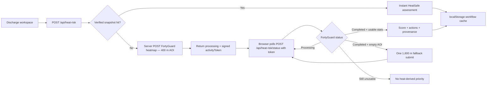

# HeatSafe Discharge

Heat-aware discharge coordination for **hospital and health-system discharge teams**. HeatSafe converts FortyGuard environmental intelligence with patient vulnerability, journey factors, and home support into transparent workflow priorities and owned discharge actions.

**Live demo:** [fortyguard-hackathon.vercel.app](https://fortyguard-hackathon.vercel.app)  
**Repository:** [github.com/AK-RM/fortyguard-hackathon](https://github.com/AK-RM/fortyguard-hackathon)  
**Built for:** FortyGuard Hackathon '26  
**Status:** Hackathon deployment — not clinically validated

**Problem:** Discharge decisions can overlook destination heat, transport exposure, cooling access, and home support — even when a patient is clinically ready to leave the hospital.

**Buyer / user:** Hospital or health-system discharge teams coordinating same-day and next-day transitions.

**Differentiator:** HeatSafe evaluates heat at the patient's **destination** and **estimated arrival time**, not merely weather around the hospital.

**Next proof:** A prospective hospital pilot measuring identified risks, action completion, utilisation, and ROI.

---

## The Problem

A patient can be medically stable at discharge and still return to an unsafe environmental setting. During extreme urban heat, patients with cardiovascular disease, heart failure, kidney disease, respiratory disease, diabetes, advanced age, limited mobility, and heat-sensitive medications may be more vulnerable in the first days after leaving the hospital.

Traditional discharge planning considers clinical readiness and social support, but often does not incorporate **environmental heat exposure at the post-discharge destination** or **heat exposure during the hospital-to-home transition**.

## The Product

HeatSafe Discharge is a **heat-aware discharge coordination platform** designed to sit in hospital discharge workflow:

```
Today's discharges
    → Select patient
    → Hospital / origin
    → Hospital → home transition
    → Post-discharge destination
    → FortyGuard destination environmental exposure
      + Transition exposure heuristic
      + Patient vulnerability
      + Medication factors
      + Home/social support
    → Transparent workflow prioritization
    → Assigned discharge interventions
    → Track interventions to resolution
```

The platform provides:

- **Operational discharge dashboard** with synthetic patient IDs (HS-001, HS-002, HS-003)
- **One-click A/B/C demo cases** that populate the full workflow
- **Hospital → journey → home model** with Arizona location presets
- **Real FortyGuard destination environmental data** for the destination-local hourly window containing estimated arrival
- **Transparent transition exposure logic** based on transport mode and configured journey duration
- **Workflow prioritization score (0–100)** with expandable “Why this score?” breakdown
- **Assigned discharge interventions** with owner, status, and local tracking
- **HeatSafe-generated discharge considerations** summarizing what the tool added to the plan

HeatSafe augments clinical judgment. It does **not** replace clinician oversight, automatically change medications, or predict readmission or mortality.

## Demo Workflow

1. Open the **Today's discharges** dashboard.
2. Click **HS-001**, **HS-002**, or **HS-003**, or create a **New discharge assessment**.
3. Use **Load Case A/B/C** to populate the full synthetic workflow in one click.
4. Review **origin**, **journey** (transport + configured duration), and **destination**.
5. Adjust patient, medication, and home/social factors as needed.
6. Click **Run HeatSafe assessment** — verified historical snapshots return instantly for prepared Central Phoenix/Tucson demo windows; other supported Arizona locations submit a real FortyGuard job and enter a transparent processing state (with one expanded-AOI fallback when the initial hyperlocal request has no usable cells).
7. Review the **workflow prioritization score**, **FortyGuard environmental intelligence** (including provenance, configured historical date/hour, and AOI metadata), and **Why this score?** breakdown.
8. Work through **assigned discharge interventions** — update status from pending → in progress → completed.
9. Review **HeatSafe-generated discharge considerations** and the safety/provenance panel.

### Hackathon deployment constraints

- **Arizona locations only** — the hackathon API key is state-restricted; coordinates outside Arizona are rejected with a clear validation message.
- **Validated Phoenix demo preset** — one-click load of the tested Central Phoenix scenario (18 Aug 2026, 14:00 local).
- **Synthetic patients only** — HS-001/002/003; no names, MRNs, addresses, or direct identifiers.
- **Local browser persistence** — workflow state, pending activity IDs, and completed environmental cache entries are stored in `localStorage` on the demo device.
- **Asynchronous FortyGuard path** — uncached locations submit one real heatmap job and return immediately; the browser polls `/api/heat-risk/status` without blocking clinicians for minutes.

## Real vs Synthetic Data

| Data | Status |
| --- | --- |
| FortyGuard destination environmental temperature data | **Real** — verified historical snapshot for standardized Central Phoenix/Tucson cases; live async FortyGuard queries for other supported Arizona locations (with expanded-AOI fallback when needed) |
| Transition exposure | **Deterministic workflow heuristic** — derived from destination heat + transport mode + configured duration |
| Patient profiles (HS-001/002/003) | **Synthetic** |
| Conditions, medications, home/social factors | **Synthetic / editable demo inputs** |
| Journey duration | **Coordinator-entered configuration** — not a calculated route |
| Hospital → destination map | **Geographic overview only** — not a FortyGuard heatmap or road route |
| Patient identifiers / PHI | **Not requested** — synthetic IDs only |

## Why FortyGuard?

Discharge planning needs **environmental context at the patient's destination**. FortyGuard provides location-specific environmental heat data designed for urban-heat analysis that can be incorporated into discharge workflows.

HeatSafe uses FortyGuard because:

- The heatmap API accepts a **GeoJSON area of interest** centered on discharge coordinates.
- **`filter_type=1` supplies a Single Hour heatmap** — HeatSafe selects the destination-local hourly window that contains the estimated arrival time (not minute-level measurement).
- Each assessment returns an **activity ID** and normalized temperature statistics for request traceability and API transparency.
- Environmental data integrates into an operational server-side workflow rather than a generic forecast widget.

### FortyGuard time semantics (verified for hackathon deployment)

1. HeatSafe computes **exact estimated local arrival** from coordinator-entered departure time + journey duration.
2. FortyGuard `start_time` is **local time at the AOI**, not UTC.
3. HeatSafe maps estimated arrival to the **containing whole-hour bucket** (e.g. arrival 14:45 → query hour 14:00 for window 14:00–15:00 local).
4. This provides **environmental context for workflow prioritization**, not temperature measured exactly at the arrival minute.

**Case A example:** departure 2026-08-18 14:00 America/Phoenix + 45 min → estimated arrival 14:45 local → FortyGuard request `start_date: 2026-08-18`, `start_time: 14:00`, `filter_type: 1`.

## Environmental Data Architecture

HeatSafe decouples environmental data acquisition from clinician-facing review. FortyGuard requests run **server-side**; the application computes the **estimated destination-arrival time** and submits live heatmap jobs **asynchronously** when no verified snapshot applies.

- **Server-side FortyGuard calls:** The browser never holds the API key or submits heatmap jobs directly.
- **Signed activity tokens:** After an async submit, the browser receives an HMAC-signed activity token — not a trusted environmental payload. Status polling must present that token; the server re-derives the original query and input fingerprint and rejects mismatches.
- **Client cache is not trusted for scoring:** Browser-stored environmental cache entries are convenience only. `/api/heat-risk` ignores client-supplied cache data; only server-verified snapshots short-circuit scoring.
- **Verified snapshot hit:** If a verified historical result matches the canonical query exactly, assessment completes immediately with provenance `verified_historical_snapshot`.
- **Live async path:** Uncached Arizona queries submit one real FortyGuard job at a **400 m AOI**, return `processing` immediately, and the browser polls `/api/heat-risk/status` while the case is open.
- **Controlled AOI fallback:** If a completed request contains no usable cells or statistics, one **1,600 m fallback** may occur around the same destination. A second expanded retry is rejected.
- **Plausible statistics required:** Environmental results must contain usable temperature statistics. If usable data remains unavailable, HeatSafe produces **no heat-derived priority** rather than inventing values.
- **Provenance labels:** Results are distinguished as `live_fortyguard`, `verified_historical_snapshot`, or `unavailable`.
- **Refresh from FortyGuard:** Explicit refresh bypasses verified cache for the same query while keeping the current result visible until a new live result completes.
- **Stale input safety:** Input fingerprint changes invalidate pending activities so old FortyGuard results cannot finalize the wrong patient/input set.

Standardized demo cases **A/B/C** intentionally share one **verified historical FortyGuard result** for Central Phoenix (2026-08-18 14:00–15:00 local) so environmental exposure is controlled while patient vulnerability profiles remain distinct. A separate **Compare environmental exposure** panel on the dashboard holds an existing demo patient constant (automatically **HS-003 / Case C** when it produces the strongest legitimate workflow delta) and contrasts two verified FortyGuard snapshots for the same destination at different arrival-hour windows (14:00 vs 06:00 local). Arbitrary Arizona coordinates are **not** hardcoded and use the live async path.

Verified historical snapshots are **narrowly labelled** and are never described as live data. Numerical HeatSafe weights remain heuristic and are **not clinically calibrated**.

A production hospital deployment would persist activities and environmental results server-side so multiple users and devices share them. This hackathon deployment uses browser persistence for workflow state.

## Architecture



### Key modules

| File | Role |
| --- | --- |
| `src/components/discharge-dashboard.tsx` | Today's discharges operational dashboard |
| `src/components/discharge-workspace.tsx` | Full discharge assessment and intervention workspace |
| `src/lib/demo-cases.ts` | A/B/C synthetic case definitions (HS-001/002/003) |
| `src/lib/arizona-locations.ts` | Arizona presets and coordinate validation |
| `src/lib/transition-exposure.ts` | Deterministic hospital-to-home transition heuristic |
| `src/lib/heat-discharge-risk.ts` | Weighted scoring engine with structured contributions |
| `src/lib/discharge-actions.ts` | Action task creation and status updates |
| `src/lib/discharge-storage.ts` | Browser localStorage persistence layer |
| `src/lib/activity-token.ts` | HMAC-signed activity tokens binding status checks to server queries |
| `src/app/api/heat-risk/route.ts` | Assessment submit: verified snapshot hit or async FortyGuard job |
| `src/lib/environmental-query.ts` | Canonical FortyGuard environmental query + cache key |
| `src/lib/verified-environmental-seed.ts` | Verified historical FortyGuard results (Central Phoenix + Tucson) |
| `src/lib/clinical-methodology.ts` | CDC/AHRQ/WHO rationale mapping for factors and actions |
| `src/lib/environmental-comparison.ts` | Matched-patient environmental counterfactual logic |
| `src/lib/environmental-cache.ts` | Verified + browser cache lookup/store helpers |
| `src/app/api/heat-risk/status/route.ts` | Token-bound FortyGuard status check, AOI fallback, assessment finalization |

## Scoring Methodology

### Clinical rationale and evidence

HeatSafe's included risk factors and action categories are informed by authoritative public-health and discharge-planning guidance:

| Source | Role in HeatSafe |
| --- | --- |
| [CDC Clinical Guidance for Heat and Health](https://www.cdc.gov/heat-health/hcp/clinical-guidance/index.html) | Heat vulnerability factors, warning-sign education, clinician review principles |
| [CDC Heat and Medications — Guidance for Clinicians](https://www.cdc.gov/heat-health/hcp/clinical-guidance/heat-and-medications-guidance-for-clinicians.html) | Medication **review** actions — never automatic medication changes |
| [CDC Heat and Older Adults](https://www.cdc.gov/heat-health/risk-factors/heat-and-older-adults-aged-65.html) | Advanced age as a heat-vulnerability consideration |
| [CDC Extreme Heat Risk Factors](https://www.cdc.gov/extreme-heat/risk-factors/index.html) | Chronic conditions and social vulnerability factors |
| [AHRQ IDEAL Discharge Planning](https://www.ahrq.gov/patient-safety/patients-families/engagingfamilies/strategy4/index.html) | Discharge coordination, home conditions, caregiver participation, follow-up |
| [WHO Keep Cool in the Heat](https://www.who.int/europe/news-room/fact-sheets/item/keepcool-in-the-heat) | Cooling access and protective planning context |

**What guidance supports:** factor selection, action category selection, and clinician-facing rationale in the UI (`src/lib/clinical-methodology.ts`, Clinical basis & methodology panel).

**What guidance does NOT support:** numerical HeatSafe coefficients, priority thresholds (25 / 50 / 75), outcome prediction, or any claim that CDC/AHRQ/WHO validate the score.

HeatSafe is **not** a diagnostic or predictive model. The workflow prioritization score is a transparent heuristic for coordinating follow-up effort.

### Evidence-informed factor selection

HeatSafe includes factors recognized as heat-vulnerability considerations in discharge coordination:

- Advanced age
- Cardiovascular disease, heart failure, kidney disease, respiratory disease, diabetes
- Cognitive impairment and limited mobility
- Heat-sensitive medication classes
- Home cooling, isolation, transport, caregiver access, power-dependent equipment
- Destination environmental heat and hospital-to-home transition exposure

These factors inform **what the workflow surfaces** — not validated outcome probabilities.

### Heuristic relative weighting — not clinically calibrated

The exact numerical points are **not fitted clinical coefficients**. They are deterministic relative priorities designed to:

- Make major vulnerability combinations escalate appropriately
- Remain transparent and inspectable via the score explainer
- Be tunable under future clinical governance

Priority thresholds (25 / 50 / 75) are **workflow tiers**, not validated outcome cutoffs.

Implementation mapping: `src/lib/clinical-methodology.ts`.

| Category | Factor | Points |
| --- | --- | --- |
| Environmental | Moderate mean destination heat (≥ 28 °C) | 8 |
| Environmental | High mean destination heat (≥ 32 °C) | 15 |
| Environmental | Moderate peak destination heat (≥ 35 °C) | 8 |
| Environmental | High peak destination heat (≥ 38 °C) | 15 |
| Environmental | Journey transition modifier (transport + duration, capped) | max 18 |
| Clinical | Age 65–74 | 5 |
| Clinical | Age ≥ 75 | 10 |
| Clinical | Heart failure | 12 |
| Clinical | Kidney disease | 12 |
| Clinical | Other comorbidities / medications | 6–10 |
| Home / support | No working AC | 15 |
| Home / support | Lives alone | 10 |
| Home / support | No reliable transport / no caregiver check-in | 10 each |

## Early Clinician Usability Feedback

Eight physicians participated in a structured review of HeatSafe using **synthetic patient cases**. Each physician reviewed **three** standardized synthetic cases, producing **24 clinician–case reviews**. Each physician also completed **one** structured survey (**eight surveys total**, not 24).

| Metric | Result |
| --- | --- |
| Physicians | 8 |
| Clinician–case reviews | 24 (8 × 3 synthetic cases) |
| Structured surveys | 8 (one per physician) |
| Mean recommendation usefulness | 4.6 / 5 |
| Mean clinical sensibility | 4.8 / 5 |
| Mean value added by environmental information | 4.6 / 5 |
| Identified an additional consideration | 8 / 8 |
| Said HeatSafe could realistically improve discharge planning | 7 / 8 |

Frequently mentioned considerations included **air conditioning**, **transport**, and **temperature at discharge**. One physician specifically requested **one-click EHR integration** with recommendations carried into the discharge summary.

This is **early usability evidence involving synthetic cases** — not clinical validation, an outcomes study, or evidence that HeatSafe reduces readmissions. Aggregate configuration lives in `src/lib/clinician-validation.ts`.

## Safety & Failure Modes

- **Not clinically validated** — score is workflow prioritization, not outcome prediction.
- **No automatic clinical actions** — medication and fluid actions require clinician/pharmacist review.
- **FortyGuard failure** — if environmental data is unavailable, HeatSafe returns a clear failure state and does **not** produce a reassuring environmental priority or fake zero-risk result.
- **Server-side API key** — `FORTYGUARD_API_KEY` is never exposed to the browser.
- **Synthetic demo only** — no PHI collected or stored.

## FortyGuard API Example

Real request and completed status response captured during HeatSafe Case A development (`npm run test:heatmap`, August 2026). API key omitted.

HeatSafe computes the estimated local arrival time and queries the FortyGuard Single Hour local window containing that arrival. The returned temperatures represent the destination-local hourly heatmap window (14:00–15:00), not a minute-level measurement at 14:45.

### Scenario (Case A)

| Field | Value |
| --- | --- |
| Destination | Central Phoenix, Arizona |
| Coordinates | 33.4484, -112.074 |
| Planned departure | 2026-08-18 14:00 America/Phoenix |
| Configured journey duration | 45 minutes |
| Estimated arrival | 2026-08-18 14:45 America/Phoenix |
| FortyGuard Single Hour window | 2026-08-18 14:00–15:00 local |

### Request — `POST /v1/heatmap`

Headers: `api-key: [REDACTED]`, `Content-Type: application/json`

```json
{
  "polygon_aoi": {
    "type": "FeatureCollection",
    "features": [
      {
        "type": "Feature",
        "properties": {},
        "geometry": {
          "type": "Polygon",
          "coordinates": [
            [
              [-112.07615323575997, 33.446603377650014],
              [-112.07184676424002, 33.446603377650014],
              [-112.07184676424002, 33.450196622349985],
              [-112.07615323575997, 33.450196622349985],
              [-112.07615323575997, 33.446603377650014]
            ]
          ]
        }
      }
    ]
  },
  "date_time": {
    "start_date": "2026-08-18",
    "start_time": "14:00",
    "filter_type": 1
  },
  "granularity": 100
}
```

### Completed status — `GET /v1/status/{activity_id}`

Activity ID: `c2307681-94c3-40ff-b2ac-952d47d1fb9f`

Sanitized response (polygon geometry and distribution arrays omitted):

```json
{
  "error": false,
  "status_code": 200,
  "message": "Completed",
  "data": {
    "activity_id": "c2307681-94c3-40ff-b2ac-952d47d1fb9f",
    "status": "Completed",
    "result": {
      "stats_data": {
        "temperature_stats": {
          "minimum": 41.5432,
          "maximum": 41.5619,
          "mean": 41.55235,
          "standard_deviation": 0.00659282438210968
        }
      },
      "map_data": {
        "type": "FeatureCollection",
        "features": "[16 heatmap cells — geometry omitted]"
      }
    }
  }
}
```

The full response `map_data` contained **16** `FeatureCollection` heatmap cells with per-cell temperature properties.

To reproduce this capture locally:

```bash
npm run test:heatmap
```

## AI Tools Used

- **[Cursor](https://cursor.com)** — implementation, refactoring, test authoring, and documentation in this repository.
- **ChatGPT / Codex** — research synthesis, pitch development, presentation/script drafting, and final submission review.

Product decisions and final claims were reviewed by the participant. AI tools did **not** independently conduct the physician reviews.

## Local Development

### Prerequisites

- Node.js 20.9+
- FortyGuard API key with Arizona coverage
- Local signing secret for activity tokens (`HEATSAFE_STATE_SIGNING_SECRET`)

### Setup

```bash
git clone https://github.com/AK-RM/fortyguard-hackathon.git
cd fortyguard-hackathon
npm install
cp .env.example .env
```

Add both required variables to `.env` (server-side only — never commit):

```env
FORTYGUARD_API_KEY=
HEATSAFE_STATE_SIGNING_SECRET=
```

Generate a signing secret locally:

```bash
openssl rand -base64 32
```

Copy the generated value into `HEATSAFE_STATE_SIGNING_SECRET`, **including any trailing `=` characters**. Then start the dev server:

```bash
npm run dev
```

Open [http://localhost:3000](http://localhost:3000).

### Scripts

| Command | Purpose |
| --- | --- |
| `npm run dev` | Start development server |
| `npm run build` | Production build |
| `npm test` | Run Vitest unit tests |
| `npm run lint` | ESLint |
| `npm run test:api` | Manual FortyGuard connectivity check |
| `npm run test:heatmap` | Manual heatmap submit + poll check |

## Known Limitations

- **Synthetic cases only** — HS-001/002/003 are demo patients, not real clinical records.
- Workflow prioritization score is **experimental and not clinically validated**; it does **not** represent readmission, mortality, or cost outcomes.
- The physician exercise is **early usability evidence**, not evidence of improved outcomes.
- HeatSafe has **not** demonstrated reduced readmissions or financial savings.
- Production adoption would require **prospective validation**, clinical governance, privacy/security review, and EHR integration.
- Verified historical snapshots are **narrowly labelled** and are not presented as live environmental data.
- Hackathon deployment supports **Arizona coordinates only**.
- **One FortyGuard destination query** per assessment; transition exposure is a transparent heuristic, not a second environmental observation.
- Journey duration is **user-configured**, not derived from a routing provider.
- Workflow persistence uses **browser localStorage** — not suitable for production multi-user deployment without a backend.

## What This Is Not

- Not a validated clinical risk score or diagnostic tool
- Not a substitute for clinician, pharmacist, or social-work judgment
- Not evidence of reduced readmissions, mortality, or healthcare costs
- Not a representation of real patients in the hackathon demo

---

**HeatSafe Discharge** — heat-aware discharge coordination platform built on FortyGuard environmental data.
