# HeatSafe Discharge

Heat-aware discharge decision support that combines real FortyGuard environmental data with patient vulnerability to help discharge teams prioritize safer post-hospital transitions.

**Live demo:** [fortyguard-hackathon.vercel.app](https://fortyguard-hackathon.vercel.app)  
**Repository:** [github.com/AK-RM/fortyguard-hackathon](https://github.com/AK-RM/fortyguard-hackathon)  
**Built for:** FortyGuard Hackathon '26  
**Status:** Prototype — not clinically validated

---

## The Problem

A patient can be medically stable at discharge and still return to an unsafe environmental setting. During extreme urban heat, patients with factors such as cardiovascular disease, heart failure, kidney disease, respiratory disease, diabetes, advanced age, limited mobility, and heat-sensitive medications may be more vulnerable in the first days after leaving the hospital.

Traditional discharge planning considers clinical readiness and social support, but it often does not incorporate **environmental heat exposure at the patient's discharge destination**. Discharge coordinators need a practical way to bring destination-specific heat context into the workflow without replacing clinical judgment.

## The Solution

HeatSafe Discharge is a prototype workflow tool for hospital discharge teams. It combines:

- **Real FortyGuard environmental temperature data** at the planned discharge location and time
- **Patient clinical vulnerability factors** (age and comorbidities)
- **Heat-sensitive medication flags**
- **Home and social support factors** (cooling, transport, caregiver access, power-dependent equipment)

The app produces a transparent, deterministic assessment:

| Output | Description |
| --- | --- |
| **Prototype prioritization score** | 0–100 workflow score (not a clinical probability) |
| **Priority tier** | Routine, enhanced, high, or urgent |
| **Triggered risk factors** | Explainable factors grouped as Environmental, Clinical, or Home / support |
| **Recommended discharge actions** | Concrete next steps for the care team |
| **Suggested action owners** | Treating clinician, pharmacist, discharge coordinator, social worker, or community-care team |
| **Environmental transparency** | FortyGuard activity ID, local/UTC timestamps, and retrieved temperature values |
| **Clinical safety disclaimer** | Clear prototype-only messaging throughout the UI |

HeatSafe Discharge is designed to **augment clinical judgment**, not replace it.

## Demo

Try the live app at [fortyguard-hackathon.vercel.app](https://fortyguard-hackathon.vercel.app):

1. **Load the demo patient** or enter patient factors manually.
2. **Review the fixed Phoenix environmental scenario** shown in the read-only demo panel.
3. **Adjust age, comorbidities, medications, and home/social factors** to explore different vulnerability profiles.
4. **Run the assessment** — the app calls the backend, which retrieves live FortyGuard data.
5. **Review FortyGuard environmental data** in the results panel, including mean/max/min temperatures and API metadata.
6. **Inspect the score and triggered risk factors**, grouped by category.
7. **Review recommended actions and suggested owners**, with checkboxes for coordinator workflow use.

### Hackathon demo constraints

For judging reproducibility, **environmental inputs are locked** to one validated Phoenix scenario:

| Field | Value |
| --- | --- |
| Location | Central Phoenix, Arizona |
| Latitude | 33.4484 |
| Longitude | -112.074 |
| Discharge date | 18 August 2026 |
| Discharge time | 14:00 local |
| Time zone | `America/Phoenix` |

- **Patient and home/social factors remain fully interactive.**
- **Temperatures are retrieved from FortyGuard and are not hardcoded.**
- The API rejects requests that do not match this scenario (HTTP 400), even if the frontend is bypassed.

The preloaded demo patient is a **synthetic profile** (age 78, heart failure, kidney disease, diuretic therapy, no working air conditioning, lives alone, no caregiver check-in). No real patient identifiers are used.

## Real vs Synthetic Data

| Data | Status |
| --- | --- |
| FortyGuard environmental temperature data | **Real** — retrieved from the FortyGuard API at assessment time |
| Patient profile | **Synthetic** — demo inputs only |
| Conditions and medications | **Synthetic** — demo inputs only |
| Home/social factors | **Synthetic** — demo inputs only |
| Phoenix discharge scenario | **Controlled demo scenario** — fixed for hackathon reproducibility |
| Patient identifiers / PHI | **Not collected** — no names, MRNs, or addresses |

## Why FortyGuard?

Generic weather apps report broad forecast conditions. Discharge planning needs **environmental context at the patient's destination** — including urban heat conditions that can vary spatially within a city.

FortyGuard adds value to this workflow because:

- It provides **environmental heat data designed for urban-heat analysis**, suitable for location-specific discharge decisions.
- The heatmap API accepts a **GeoJSON area of interest** centered on discharge coordinates, enabling spatially relevant analysis rather than a city-wide average alone.
- Results integrate into an **operational healthcare workflow** via a server-side API route with structured request/response handling.
- Each analysis returns a **FortyGuard activity ID** and normalized temperature statistics, supporting API transparency and auditability in the results panel.

This prototype submits a ~400 m square polygon around the discharge point, polls the asynchronous heatmap job until completion, and maps `stats_data` (with `map_data` fallback) into mean and maximum temperatures for scoring.

## How It Works

```mermaid
flowchart LR
    A[Discharge coordinator] --> B[Patient + home profile]
    B --> C[POST /api/heat-risk]
    C --> D[Validate Phoenix demo scenario]
    D --> E[Local Phoenix time → UTC]
    E --> F[FortyGuard heatmap API]
    F --> G[Poll activity status]
    G --> H[Environmental data normalization]
    H --> I[Deterministic risk engine]
    B --> I
    I --> J[Priority + risk factors + actions]
    J --> K[Results panel in UI]
```



### Request flow (verified from code)

1. The coordinator edits the **patient, medication, and home/social profile** in the frontend (`src/components/discharge-assessment.tsx`).
2. `buildApiPayload()` attaches the **fixed Phoenix environmental values** from `src/lib/discharge-locations.ts` and posts to **`POST /api/heat-risk`**.
3. `parseHeatRiskRequest()` validates structure, types, and the **hackathon demo environment lock** (`src/lib/parse-heat-risk-request.ts`).
4. The planned local discharge time is converted to UTC for FortyGuard (`src/lib/discharge-timezone.ts`). For the demo scenario, **14:00 America/Phoenix → 21:00 UTC** on 18 August 2026.
5. `fetchHeatRiskAnalysis()` submits a heatmap job to FortyGuard, then **polls every 5 seconds for up to 2 minutes** until the activity completes (`src/lib/fortyguard.ts`).
6. `mapFortyGuardEnvironmentalData()` normalizes FortyGuard `stats_data` into mean and maximum temperatures in °C (`src/lib/map-fortyguard-environment.ts`).
7. `evaluateHeatDischargeRisk()` runs the deterministic scoring engine unchanged (`src/lib/heat-discharge-risk.ts`).
8. The API returns priority, score, triggered factors, recommended actions, disclaimer, and environmental metadata. The UI renders grouped factors, action owners, and FortyGuard transparency details.

## Architecture

| Layer | Technology / location |
| --- | --- |
| Frontend | Next.js 16 App Router, React 19, TypeScript, Tailwind CSS 4 |
| API route | `src/app/api/heat-risk/route.ts` (`maxDuration = 120` seconds) |
| FortyGuard client | `src/lib/fortyguard.ts` — server-side only; API key never exposed to the browser |
| Risk engine | `src/lib/heat-discharge-risk.ts` — pure TypeScript, fully testable |
| Tests | Vitest — 28 tests across timezone, parsing, mapping, and scoring modules |

### Key modules

| File | Role |
| --- | --- |
| `src/components/discharge-assessment.tsx` | Clinician UI, demo scenario display, results panel |
| `src/app/api/heat-risk/route.ts` | Orchestrates validation → FortyGuard → scoring → JSON response |
| `src/lib/fortyguard.ts` | Heatmap submission, async polling, polygon AOI construction |
| `src/lib/map-fortyguard-environment.ts` | Maps FortyGuard stats/map payloads to environmental input |
| `src/lib/heat-discharge-risk.ts` | Weighted scoring, priority tiers, recommended actions |
| `src/lib/parse-heat-risk-request.ts` | Strict request parsing and demo-environment enforcement |
| `src/lib/discharge-timezone.ts` | IANA local → UTC conversion for FortyGuard |
| `src/lib/discharge-locations.ts` | Central Phoenix demo configuration |

## Scoring Model

The engine uses **transparent, deterministic weights** — not machine learning and not validated clinical thresholds.

**Environmental heat thresholds (°C):**

| Condition | Threshold |
| --- | --- |
| Moderate mean temperature | ≥ 28 |
| High mean temperature | ≥ 32 |
| Moderate maximum temperature | ≥ 35 |
| High maximum temperature | ≥ 38 |

**Priority tiers (from capped 0–100 score):**

| Priority | Score |
| --- | --- |
| Routine | 0–24 |
| Enhanced | 25–49 |
| High | 50–74 |
| Urgent | 75–100 |

Weights cover environmental exposure, patient comorbidities, heat-sensitive medications, and home/social gaps (for example, no working air conditioning, lives alone, no caregiver check-in). Each triggered factor includes a plain-language explanation.

Recommended actions are rule-based and conditionally generated — for example, social-work cooling assessment when AC is unavailable, pharmacist medication review when heat-sensitive drugs are flagged, and clinician fluid-plan review during high heat with heart failure or kidney disease. **The tool never instructs automatic medication changes or generic hydration increases.**

## Safety Design

HeatSafe Discharge is built with explicit safety boundaries:

- **Prototype-only labeling** — the UI displays “Not clinically validated” alongside the score.
- **No PHI collection** — the app accepts structured workflow factors only; no names, MRNs, or addresses.
- **Clinical disclaimer** returned with every assessment and shown in the UI.
- **Augment, not replace** — recommended actions flag items for human review; they do not execute clinical orders.
- **Medication safety language** — actions explicitly state that medications must not be stopped or changed automatically.
- **Server-side API key isolation** — `FORTYGUARD_API_KEY` is read only on the server.
- **Demo environment lock** — prevents unsupported geographic or temporal requests from reaching FortyGuard during judging.
- **Structured error handling** — validation failures (400), FortyGuard timeouts (504), upstream failures (502), and missing configuration (503) return safe messages without leaking secrets.

## Local Development

### Prerequisites

- Node.js 18+
- A FortyGuard API key with access to the US state used during signup (the demo Phoenix scenario requires Arizona coverage)

### Setup

```bash
git clone https://github.com/AK-RM/fortyguard-hackathon.git
cd fortyguard-hackathon
npm install
cp .env.example .env
# Add your FORTYGUARD_API_KEY to .env
npm run dev
```

Open [http://localhost:3000](http://localhost:3000).

### Scripts

| Command | Purpose |
| --- | --- |
| `npm run dev` | Start the Next.js development server |
| `npm run build` | Production build |
| `npm run start` | Run production server |
| `npm test` | Run Vitest unit tests |
| `npm run lint` | ESLint |
| `npm run test:api` | Manual FortyGuard API connectivity check |
| `npm run test:heatmap` | Manual heatmap submission/polling check |

## Limitations

This is a **hackathon prototype**, not a production clinical system:

- The prioritization score is **not clinically validated** and does **not** represent probability of readmission, mortality, or any clinical outcome.
- Scoring weights and priority thresholds are **workflow labels for demo purposes** and would require clinical governance before real-world use.
- The live deployment supports **one fixed environmental scenario** (Central Phoenix, 18 Aug 2026, 14:00 local) for reproducible judging.
- FortyGuard availability, polling latency (up to ~2 minutes), and API key state restrictions can affect demo reliability.
- The app does not integrate with EHR systems, persist assessments, or support multi-site operational deployment.
- Urban heat analysis depends on FortyGuard response shape; the mapper includes fallbacks but cannot guarantee data for every edge case.

## Future Direction

HeatSafe Discharge demonstrates a vertical slice of a broader product concept:

- **Configurable discharge destinations** — unlock environmental inputs per hospital catchment area once API coverage and validation are established.
- **EHR-aware workflows** — pre-populate structured vulnerability factors from discharge planning data without storing PHI in the demo layer.
- **Clinically governed scoring** — replace prototype weights with evidence-reviewed criteria and institution-specific escalation pathways.
- **Operational integration** — embed assessments into discharge checklists, care-management queues, and pharmacist/social-work referral workflows.
- **Audit and quality improvement** — use FortyGuard activity IDs and structured outputs for retrospective review of heat-related discharge decisions.

No proven cost savings, readmission reductions, or outcome improvements are claimed for this prototype.

## What This Is Not

- Not a validated clinical risk score or diagnostic tool
- Not a substitute for clinician, pharmacist, or social-work judgment
- Not evidence of reduced readmissions, mortality, or healthcare costs
- Not a representation of a real patient in the hackathon demo

---

**HeatSafe Discharge** — prototype decision support for heat-aware hospital discharge coordination, built on FortyGuard environmental data.
